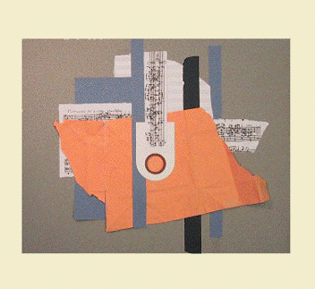

**OpenMusic (OM)** is a visual programming language for computer-assisted music composition created at [IRCAM](http://www.ircam.fr), inheriting from a long tradition of computer-assisted composition research.

The <a href="https://github.com/openmusic-project/" target="_blank">openmusic-project</a> gathers repositories for the main software, satellite projects and external libraries. 

------ 

- [OpenMusic](openmusic) main application (downloads, sources, info...)

- [OpenMusic Libraries](https://openmusic-project.github.io/libraries) : an extended set of add-on features for computer-assisted composition

- [Resources and links about OpenMusic](https://openmusic-project.github.io/links)

- [OpenMusic manual](https://openmusic-project.github.io/openmusic/doc/om6-manual/co/OM-Documentation)

------ 

This project is maintained by the <a href="http://repmus.ircam.fr/" target="_blank">Music Representation team</a> of the IRCAM <a href="https://www.stms-lab.fr/" target="_blank">STMS Lab</a>.

  

