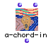

OpenMusic Reference  
---  
[Prev](a-member-of)| | [Next](addbox2maquette)  
  
* * *

# a-chord-in

  
  
a-chord-in  
  
(backtrack module) \-- Defines a list of Screamer variables with constraints
useful for building chords  

## Syntax

`` **a-chord-in**` n dom `

## Inputs

name| data type(s)| comments  
---|---|---  
` _n_`|  a non-negative integer| the length of the list  
` _n_`|  a tree| the domain for each variable  
  
## Output

output| data type(s)| comments  
---|---|---  
first| a list|  of `_n_` sorted and all-different variables (which will
themselves be lists)  
  
## Description

Functions like [`list-of-members-of`](list-of-members-of), with two added
constraints: The list is all different, i.e. you can't get (1 1 1) and the
list is growing, i.e. you can't get (2 1 3). This is useful because the output
looks more like a set, which is useful for defining chords. The actual values
returned will depend on the backtracking caused by the constraints.

* * *

[Prev](a-member-of)| [Home](index)| [Next](addbox2maquette)  
---|---|---  
a-member-of| [Up](funcref.main)| addbox2maquette

