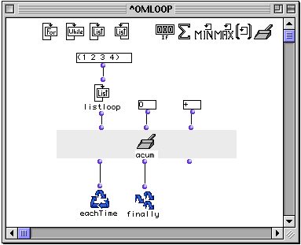
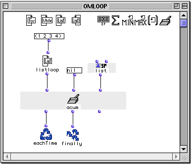
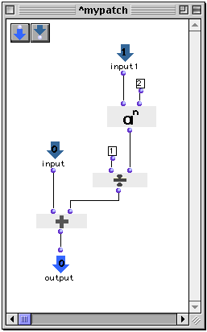
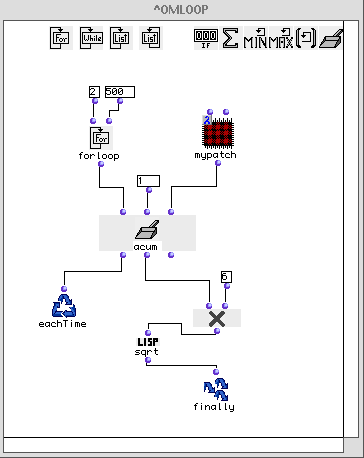
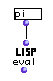

OpenMusic Reference  
---  
[Prev](listing)| | [Next](loopdo)  
  
* * *

# accumulator

  
  
accumulator  
  
(control module) \-- a general-purpose collector for the  omloop  function  

## Syntax

   **accumulator**  accum init fun &optional retard  

|

Though it is called  accumulatoor  in its LISP code, this function appears as
 acum  when used inside  omloop . The reason eludes me.  
  
---|---  
  
## Inputs

name| data type(s)| comments  
---|---|---  
  _accum_ |  any|  
  _init_ |  any| the initial value of the collection. The data type must be
acceptable to the first input of  _fun_   
  _fun_ |  a function name or lambda function| must be a binary function, i.e.
a function with two inputs  
  _retard_ |  a function name or lambda function|  
  
## Output

output| data type(s)| comments  
---|---|---  
first| any| triggers the collection  
second| any| returns the state of the collection without evaluation. Data type
will be the data type returned by  _fun_   
third| any| reinitializes the counter, resetting it to the value specified at
 _init_ .  
  
## Description

|

 accumulator  is part of a group of functions for performing iterative
[loops](glossary#LOOP). They can only be used within an
[omloop](omloop) patch window. Since they only function within the
context of the entire repeating loop, they (or any function connected to them)
cannot be evaluated directly within the patch window. You must evaluate the
entire loop. See the entry on  omloop  for more information.  
  
---|---  
  
 accum  is is the most general type of collector. For each repetition of the
loop,  accumulator  takes the value at the first input and a value previously
stored in its register and passes them both to the lambda function or patch
specified at the third input. The resulting value is stored in the register
and the loop repeats.

Like all collectors,  listing  has three outputs:

The first output triggers the collector, evaluating whatever is connected to
it and calling function  _fun_  as described above. It is usually connected to
 eachTime . The value carried by the connection itself is the current result
of the evaluation of the loop, which you can test by placing the LISP function
 print  between the first output and  eachTime .

The second output returns the current state of the collector, without
evaluating whatever is connected to it. It is usually connected to  finally 
so that you can get the results of the collection.

The third output reinitializes the collector, resetting it to whatever value
you specified at the  _init_  input. It will always return this value.

## Examples

 accum  is the most generalized type of collector. Some collectors are special
versions of the  accumulator  function. In these cases, the example of the use
of the specific collector is reproduced with accumulator to illustrate this.
You can therefore refer to the entries for the other accumulators for more
examples of its use.

### Using  accumulator  to add up a list of values

This example takes the sum of the elements (1 2 3 4). It returns:

 ? OM->10 

Here's how this happens: at each repetition of the loop, the output of
 listloop , which is stepping through the elements of the list one at a time,
is passed to the function  + , along with the value of the internal state of
the accumulator. The internal state is simply the value stored by the
accumulator at the end of the previous loop. If it is the first iteration
(there was no previous loop) then the internal state is the value specified at
the second input. The result of  +  becomes the internal state for the next
loop. On each repetition, either  eachTime  or  finally  is evaluated.
 eachTime  is evaluated on all but the last repetition, causing the
accumulator to evaluate its function at the third input. On the last
repetiton,  finally  is evaluated, which simply returns the internal state of
 accumulator . This is presented in the table below, which shows values
_after_ each loop.

Loop| Output of  listloop  (Value at the First Input of  accumulator )|
Internal State of  accumulator | Output of binary function  +   
---|---|---|---  
1| 1| 0| 1  
2| 2| 1| 3  
3| 3| 3| 6  
4| 4| 6| 10  
 |  |  |  **10**  
  
On the last repetition, the value of the internal state is returned: 10

### Making nested lists with  accumulator 

We will set up  accumulator  with the LISP function  list  instead of  + . The
other inputs are unchanged. The processing of the data is summarized below:

Loop| Output of  listloop  (Value at the First Input of  accumulator )|
Internal State of  accumulator | Output of binary function  list   
---|---|---|---  
1| 1| nil| (nil 1)  
2| 2| (nil 1)| ((nil 1) 2)  
3| 3| ((nil 1) 2)| (((nil 1) 2) 3)  
4| 4| (((nil 1) 2) 3)| ((((nil 1) 2) 3) 4)  
 |  |  |  **((((nil 1) 2) 3) 4)**  
  
### Approximating π* with  accumulator 

This example is based on a formula discovered by French mathematician Jacques
Bernoulli (1654-1705). The formula calculates π The square root of the sum of
an infinite series of fractions where the denominators are squares of the
integers, multiplied by 6: (remeber that the notation a^b means a to the bth
power)

π = (6 (1/1^2 + 1/2^2 + 1/3^2 + 1/4^2 +...))^.5

Calculating this series out to a greater length gives a more accurate
estimation of π.The terms of the series, namely one over the square of an
integer, and their sum can be represented by the following patch:

The input 1 will be an integer, which will be squared, and used to divide one.
The result will be added to input 0, which will be the internal state of the
accumulator. This patch,  mypatch , is connected in lambda mode to the third
input of  accumulator . The second input is set to one (setting it to zero
would cause a division-by-zero error in the first iteration of the loop) and
the first input takes the output of a  forloop , which will tick off the
integers between 2 and 500, inclusive (we didn't do 1 to 500 because the
accumlator is already initialized to 1)

At each repetition, the number from  forloop  is passed to  mypatch  along
with the internal state, and the result becomes the new internal state. This
calculates the repeating, infinite series at the heart of Bernoulli's
equation. After the series has been calculated, all that remains is to
multiply it by 6 and take the square root. This is post-processing. Note that
is performed by functions inserted _between_ the second output of
 accumulator  and  finally .

As we said, extending the series gives a more accurate result. With 500 steps,
this loop returns:

 ? OM->3.139684123138722 

With 5000 steps, the result becomes more accurate:

 ? OM->3.141401680950935 

This example is to demonstrate the use of a patch in lambda mode with
 accumulator . There is a much easier way to get π. If you just wanted π for a
calculation, it would be better to use the function  eval  with the constant
 _pi_  :

### About pi

π or pi, is the ratio of the circumference of a circle to its diameter it is
an irrational number, meaning that it is a number with decimal places that do
not repeat in any discernable pattern, ever. It thus cannot be represented by
a finite series of numbers. The first ten decimal places of π are:
3.1415926535... and it just keeps going!

* * *

[Prev](listing)| [Home](index)| [Next](loopdo)  
---|---|---  
listing| [Up](funcref.omloop)| loopdo (eachTime)

