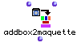
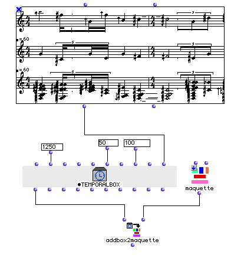
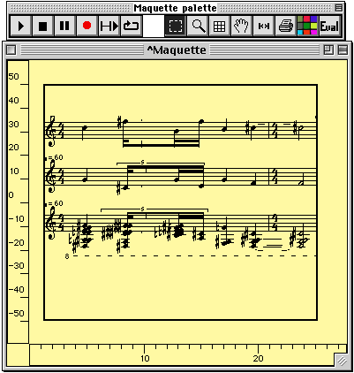
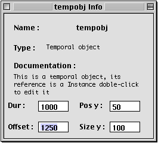

OpenMusic Reference  
---  
[Prev](a-chord-in)| | [Next](an-integer-between)  
  
* * *

# addbox2maquette

  
  
addbox2maquette  
  
(maquette module) \-- places a [**Temporalbox**](temporalbox) inside a
**Maquette**  

## Syntax

`` **addbox2maquette**` self maquette `

## Inputs

name| data type(s)| comments  
---|---|---  
` _self_`|  a [**Temporalbox**](temporalbox) object| see description  
` _maquette_`|  a **Maquette** in 'itself' mode| see description  
  
## Output

output| data type(s)| comments  
---|---|---  
first| a [**Temporalbox**](temporalbox) object| The output will be the
same as the first input; the action is performed on the **Maquette** at the
second input  
  
## Description

`addbox2maquette` takes an object and places it inside a maquette. The first
input takes a [**Temporalbox**](temporalbox) object. While this input is
always a [**Temporalbox**](temporalbox), the
[**Temporalbox**](temporalbox) may itself contain any of the following
object types (see examples):

  * another [**Temporalbox**](temporalbox)

  * a [_patch_](glossary#PATCH)

  * a [_factory_](glossary#FACTORY) ( **Voice** , **Chord-seq** , etc.)

  * a **Midifile** object

  * a **Soundfile** object

  * a [**Maquette**](glossary#MAQUETTE)

The second input takes a **Maquette** object in 'itself' mode. See the
[chapter on patches](concepts.patches) for more information on object
states. To put an object in 'itself' mode, click on it once and hit **b**. A
small box appears with an 'x' in it. Click this box three times to cycle
through the modes. 'Itself' mode is indicated by a down arrow: ↓ This means
that the maquette will pass itself rather than its output.

The placement and behavior of the object within the **Maquette** is determined
by the inputs of the [**Temporalbox**](temporalbox) object, as
illustrated below.

To remove temporal boxes from maquettes, use
[`removetemporalbox`](removetemporalbox)

For a complete discussion of the maquette concept, see the chapter
[Maquettes](concepts.maquettes)

## Examples

### Using `addbox2maquette`

Here we place a **Poly** object in a **Maquette**. The **Poly** must be
contained in a [**Temporalbox**](temporalbox), so we plug it into the
last input of a [**Temporalbox**](temporalbox) factory, along with other
parameters describing its placement within the **Maquette** : 1250 for the
offset in milliseconds from the 0 point, 50 for the position on the y axis,
and 100 for the height of the box. The other inputs could have been used to
control the horizontal dimension of the box, its color, etc.

Opening the **Maquette** by double-clicking on it reveals the newly placed box
(you may have to adjust the axes to see it). Selecting it and hitting **m**
turns on mini-visualization of the box's contents:

The parameters controlling the placement of the
[**Temporalbox**](temporalbox) can be viewed and modified by selecting
the box and hitting Command- **i** , which opens a box similar to the one
below:

Closing the info window applies any changes you've made to the
[**Temporalbox**](temporalbox).

* * *

[Prev](a-chord-in)| [Home](index)| [Next](an-integer-between)  
---|---|---  
a-chord-in| [Up](funcref.main)| an-integer-between

