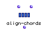

OpenMusic Reference  
---  
[Prev](aftertouch)| | [Next](append)  
  
* * *

# align-chords

  
  
align-chords  
  
(score module) \-- combines chords falling within a certain threshold duration
into a single element  

## Syntax

   **align-chords**  self delta  

## Inputs

name| data type(s)| comments  
---|---|---  
  _self_ |  A [**Chord-seq**](chord-seq) object|  
  _delta_ |  a positive number|  
  
## Output

output| data type(s)| comments  
---|---|---  
first| A [**Chord-seq**](chord-seq) object|  
  
## Description

This function cleans up [**Chord-seq**](chord-seq) objects by combining
Chords with similiar onsets. When [ align-chords ](align-chords)
encounters two onsets that are separated by less than  _delta_  , it adds the
first note to the second chord and deletes the original.

* * *

[Prev](aftertouch)| [Home](index)| [Next](append)  
---|---|---  
aftertouch| [Up](funcref.main)| append

