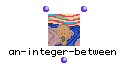

OpenMusic Reference  
---  
[Prev](addbox2maquette)| | [Next](aftertouch)  
  
* * *

# an-integer-between

  
  
an-integer-between  
  
(backtrack module) \-- defines a Screamer variable within the specified
interval  

## Syntax

`` **an-integer-between**` low high `

## Inputs

name| data type(s)| comments  
---|---|---  
` _low_`|  an integer| the minimum of possible values for the variable  
` _high_`|  an integer| the maximum of possible values for the variable  
  
## Output

output| data type(s)| comments  
---|---|---  
first| an integer| between `_low_` and `_high_`  
  
## Description

Defines a Screamer variable in the interval [` _low_` `_high_` ] Without
constraints, `an-integer-between` enumerates all the integers between the two
inputs. The output will depend on the backtracking caused by the constraints.

* * *

[Prev](addbox2maquette)| [Home](index)| [Next](aftertouch)  
---|---|---  
addbox2maquette| [Up](funcref.main)| aftertouch

