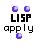

OpenMusic Reference  
---  
[Prev](append)| | [Next](approx-m)  
  
* * *

# apply

  
  
apply  
  
(LISP function) \-- returns the result of the evaluation of  _function_   

## Syntax

   **apply**  function first-arg &restmore-args  

## Inputs

name| data type(s)| comments  
---|---|---  
  _function_ |  symbol, function name or lambda function | the function that will be evaulated  
  _first-arg_ |  list or number| Must be a list if  _more-args_  are not used. May be a list if  _more-args_  is present and _function_  accepts lists.  
  _more-args_ |  list or number| repeatable; if used, the last input **must** be a list.  
  
## Output

output| data type(s)| comments  
---|---|---  
first| any| the result of the evaluation  
  
## Description

Runs  _function_  , passing it  _first-arg_  and  _more-args_  (if present) as
arguments. The last input, whether  _first-arg_  or  _more-args_  , must be a
list. Values from this input are passed individually to  _function_  as
arguments. In contrast, lists present at any input other than the last are
passed in their entirety as arguments. This particularity of the structure of
 apply  exists to make it possible to call extensible functions (functions
with &rest inputs).

 _function_  may be a symbol, a function name, or function in lambda mode.
Note that if you pass a function in lambda mode with repeatable inputs, you
must add the correct number to accomodate the number of arguments you are
passing it at the other inputs. This is not necessary if the function name is
entered directly instead of its icon in lambda mode.

 apply  is similar to [ funcall ](funcall) in operation. The difference
is that  funcall  passes all of its inputs as single arguments regardless of
whether they are lists ot not.

 apply  only calls  _function_  once. If you need to  apply  a function
multiple times to data in a list or lists, consider using
[ mapcar ](mapcar) or [ mapcan ](mapcan).

|  **LISP functions**  
---|---  
 |

The basic LISP functions are too numerous to document comprehensively in this
manual. As an aid to the neophyte, the most commonly used have been included
in this documentation, but they represent a small fraction of the total
functionality of the [MCL](glossary#MCL) environment. Numerous on-line
resources exist, for instance the [online version of _Common Lisp the
Language, 2nd Edition_.](http://www-2.cs.cmu.edu/afs/cs.cmu.edu/project/ai-
repository/ai/cltl/clm/)  
  
## Examples

### Summing a list with  apply 

Here we use  apply  to add the elements of a list. Since  _first-arg_  is the
last input present, its elements 1, 2, 3, and 4 are passed individually to the
function  +  as arguments.  +  could have been the function icon in lambda
mode:  though note that we would have
had to manually add the four inputs for the four arguments. The result, either
way:

 ? OM->10 

### Creating a list with  apply 

Here we use  apply  to create a list, illustrating the particularity of the
last input. The arguments are passed sequentially to the function called, in
this case,  list . The result:

 ? OM->((7 8) 3 1 2 3 4) 

Notice that (7 8) appears in its own parentheses because it was passed as a
single argument to  list , while 1 2 3 4 appear without, because they were
passed individually as arguments, because they occur at the last input.

* * *

[Prev](append)| [Home](index)| [Next](approx-m)  
---|---|---  
append| [Up](funcref.main)| approx-m

