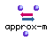
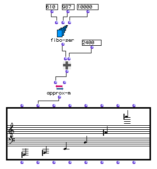

OpenMusic Reference  
---  
[Prev](apply-cont)| | [Next](arithm-ser)  
  
* * *

# approx-m

  
  
approx-m  
  
(conversions module) \-- rounds off midics to fit whole-number divisions of
the octave  

## Syntax

`` **approx-m**` midic approx &optional ref-midic `

## Inputs

name| data type(s)| comments  
---|---|---  
` _midic_`|  an integer or list thereof| the midics to round off  
` _approx_`|  a positive number| the subdivision of the octave to respect;
defaults to 2. Note that decimal values are allowed  
` _ref-midic_`|  an integer| optional; specifies a reference pitch, as a midic  
  
## Output

output| data type(s)| comments  
---|---|---  
first| an integer or list thereof|  
  
## Description

This function accepts either a [_midic_](glossary#MIDIC) value or a list
of midic values at its first input. They will be rounded off to their nearest
note in an equal-tempered subdivision of the octave. This subdivision is
specified at the second input. The octave of 1200 midics will be subdivided
into (` _approx_` *6) equal parts, and the values of `_midic_` will be rounded
to these numbers. The default value of 2 for `_approx_` produces a traditional
twelve-tone octave. 1 will produce a whole-tone, 6-step subdivision. 4 will
produce a quarter-tone, 24-step division, and 8 will produce an eighth-tone,
48-step division of the octave. Other integers may be entered if desired do
divide the octave in other ways.

The optional `_ref-midic_` input allows you to specify a reference pitch, in
midics. This pitch will be subtracted from all the midics before the
approximation is performed, and the resulting pitch or list will thus be
relative to this midic.

## Examples

### Converting a fibonacci series to midics with `approx-m`

Here we turn a [_fibonacci series_](glossary#FIBONACCI-SERIES) into a
melodic line. The `fibo-ser` function will return the elements of the
fibonacci series starting with 610 and 987 and running through 6765: (610 987
1597 2584 4181 6765)

We will consider these values as midics. We add 2400 to these values
(transposing them up 2 octaves), yielding (3010 3387 3997 4984 6581 9165).
Then we pass them to `approx-m`, which rounds them to semitones by default:

`? OM->(3000 3400 4000 5000 6600 9200)`

We now have a list of midics rounded off to the nearest semitone, which we can
process in other ways. We can visualize them by plugging them into the second
input of a **Chord-seq** object. **Note that the **Chord-seq** object always
displays its midics rounded off to nearest semi-, quarter-, or eighth-tone. If
our goal was simply to visualize the pitches, we could have plugged the `om+`
results directly into the second input of **Chord-seq**.**

* * *

[Prev](apply-cont)| [Home](index)| [Next](arithm-ser)  
---|---|---  
apply-cont| [Up](funcref.main)| arithm-ser

