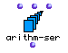
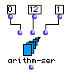

OpenMusic Reference  
---  
[Prev](approx-m)| | [Next](atomlisp)  
  
* * *

# arithm-ser

  
  
arithm-ser  
  
(series module) \-- generates an arithmetic series  

## Syntax

   **arithm-ser**  begin end step &optional nummax  

## Inputs

name| data type(s)| comments  
---|---|---  
  _begin_ |  a number| the starting point of the series  
  _end_ |  a number| the upper limit of the series  
  _step_ |  a number| the increment of the series  
  _nummax_ |  a non-zero integer| optional; the maximum number of terms
produced. Defaults to 536870911  
  
## Output

output| data type(s)| comments  
---|---|---  
first| a list|  
  
## Description

Returns an arithmetic series. An arithmetic series is a series in which the
next term is produced by adding or subtracting a fixed number to or from the
previous term in the series.

 arithm-ser  produces a list of terms starting at  _begin_  and produces new
terms by adding  _step_  until the series reaches  _end_  or would exceed
 _end_  in its next term.

The optional input  _nummax_  allows you to limit the number of terms in the
series. When it is set, the series will have a maximum of  _nummax_  terms. It
will still end on or before  _end_  , however.

## Examples

### Counting to 12

Here we see  arithm-ser  set to produce the numbers 0 through 12. The output
will be

 ? OM->(0 1 2 3 4 5 6 7 8 9 10 11 12) 

* * *

[Prev](approx-m)| [Home](index)| [Next](atomlisp)  
---|---|---  
approx-m| [Up](funcref.main)| atom

