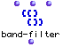

OpenMusic Reference  
---  
[Prev](atomlisp)| | [Next](bpf-sample)  
  
* * *

# band-filter

  
  
band-filter  
  
(lists module) \-- Filters elements of a tree based on their numerical
(arithmetic) value  

## Syntax

`` **band-filter**` list bounds mode `

## Inputs

name| data type(s)| comments  
---|---|---  
` _list_`|  a tree| the tree to filter  
` _bounds_`|  a list of pairs of numbers| must contain at least one pair of
numbers, for example ((1 3))  
` _mode_`|  menu| two options: pass and reject. Defaults to 'pass'  
  
## Output

output| data type(s)| comments  
---|---|---  
first| a tree|  
  
## Description

`band-filter` passes or rejects all elements from `_list_` that fall within
the specified values of `_bounds_`. Multiple bands of values can be specified
in the form of additional pairs of numbers as sublists of `_bounds_`. Even if
there is only one band, it must be given as a sublist of `_bounds_` , which
must thus have two levels of parentheses. Each pair of numbers defines an
interval.

If mode is set to `_pass_` , only elements within one of these intervals are
passed. If mode is set to `_reject_` , elements falling within any one of
these intervals are suppressed.

`band-filter` processes _every_ element of `_list_` regardless of the level of
nesting. Elements which are passed retain the level of
[nesting](glossary#NESTING) from the original list.

|

If you are looking to filter ranges of elements in a list based on their
position in the list rather than their value, use [`range-filter`](range-
filter)  
  
---|---  
  
## Examples

### Filtering a range of values from a tree

Mode is set to `_pass_` , so only the elements in `_list_` in the intervals
0-3 and 8-10 will be passed:

`? OM->(1 2 3 8 9 10)`

Reversing the mode will cause only elements outside of those intervals to be
passed:

`? OM->(4 5 6 7)`

* * *

[Prev](atomlisp)| [Home](index)| [Next](bpf-sample)  
---|---|---  
atom| [Up](funcref.main)| bpf-sample

