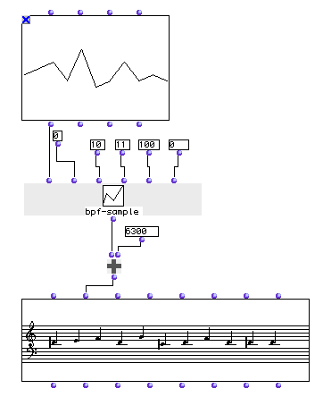

OpenMusic Reference  
---  
[Prev](band-filter)| | [Next](butlast)  
  
* * *

# bpf-sample

  
  
bpf-sample  
  
(functions module) \-- samples a [**BPF**](editors.bpf#BPF)'s values at
defined intervals  

## Syntax

   **bpf-sample**  self xmin xmax nbsamples &optional coeff nbdec  

## Inputs

name| data type(s)| comments  
---|---|---  
  _self_ |  a **BPF** object| the **BPF** to sample  
  _xmin_ |  a number| the beginning of the range of x values to sample; defaults to 0  
  _xmax_ |  a number| the end of the range of x values to sample; defaults to 100  
  _nbsamples_ |  a positive integer| the number of (evenly spaced) samples to take between  _xmin_  and  _xmax_ .  
 _coeff_ |  a number| optional; all results are multiplied by this coefficient. Defaults to 1  
 _nbdec_ |  a non-negative integer| optional; the precision of the samples. Sets the number of decimal places to register for each y value calculated. Defaults to 0  
  
## Output

output| data type(s)| comments  
---|---|---  
first| a list| containing samples of the **BPF**  
  
## Description

 bpf-sample  returns the height of the **BPF** object at defined points on the
x axis. The number of samples to calculate is set at  _nbsamples_ . These
samples are evenly spaced between  _xmin_  and  _xmax_  , inclusive.

If it is set, all the results are multiplied by  _coeff_ . and collected as
the output.

The second optional input,  _nbdec_  , sets the precision of the samples
taken. The default value is zero, which means that the measured height of the
**BPF** at each point will be rounded to the nearest integer. Setting this
value higher adds decimal points to the samples.

## Examples

### Creating a melody from a graphic contour

We will use the  bpf-sample  function to convert a hand-drawn contour to a
melodic line.

First, we draw a contour in a **BPF** editor:

Then, we pass the **BPF** to  bpf-sample . We will take 11 samples of the
function, corresponding to the points between 0 and 10, inclusive. We do not
need to use any decimal places so  _nbdec_  is set to zero. This would yield
the result: (0 1 2 -1 4 -2 -1 2 -1 0 -1), except that  _coeff_  is set to 100
(since we are going to use midics) so those values are mutliplied by 100.
 bpf-sample  returns: (0 100 200 -100 400 -200 -100 200 -100 0 -100).

This list is now a list of intervals in midics. All we have to do is decide
where to start the melody. We arbitrarily choose D♯, which is 6300 in midics.
The result is passed directly to the  om+  function, to add 6300 to all the
values of the list. The resulting list, (6300 6400 6500 6200 6700 6100 6200
6500 6200 6300 6200), is passed to the  _lmidic_  input of a **Chord-seq**
object, and the result is shown below:

* * *

[Prev](band-filter)| [Home](index)| [Next](butlast)  
---|---|---  
band-filter| [Up](funcref.main)| butlast

