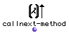

OpenMusic Reference  
---  
[Prev](butlast)| | [Next](canon-n)  
  
* * *

# callnext-method

  
  
callnext-method  
  
(control module) \-- calls the next method in the function definition  

## Syntax

   **callnext-method**   

## Inputs

None. See below.

## Output

output| data type(s)| comments  
---|---|---  
first| results of the next method|  
  
## Description

Only to be used in a method definition. Will call the method with the same
name belonging to the direct upper-classe(s) of the method argument(s). The
arguments are automatically passed to it so there is no input.

* * *

[Prev](butlast)| [Home](index)| [Next](canon-n)  
---|---|---  
butlast| [Up](funcref.main)| canon-n

