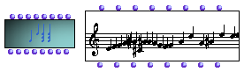

OpenMusic Reference  
---  
[Prev](chord)| | [Next](groupclass)  
  
* * *

# Chord-seq

  
  
Chord-seq  
  
(score module) \--  

## Syntax

`` **Chord-seq**` self lmidic lonset ldur lvel loffset lchan legato `

## Slots

name| data type(s)| comments  
---|---|---  
` _self_`| [ **Chord-seq**](chord-seq) object, [**Chord**](chord)
object, list of [**Chord**](chord)s, [**Voice**](voice) object,
[**Note**](note) object, list of [**Note**](note)s,
[**Midifile**](midifile) object|  
` _lmidic_`|  list of midics or list of lists of midics|  
` _lonset_`|  list of absolute onset times, in milliseconds|  
` _ldur_`|  list or list of lists of integers expressing the note durations
within the chords, in milliseconds|  
` _lvel_`|  list or list of lists of integers expressing the note velocities
within the chords (0-127)|  
` _loffset_`|  list or list of lists of positive or negative integers
expressing the note offset from the attack of the chord itself, in
milliseconds|  
` _lchan_`|  list or list of lists of integers expressing the MIDI channels of
the notes within the [**Chord**](chord)s (1-16)|  
` _legato_`|  a number between 1 and 100, indicating the duration of the
chords as a percentage of the time from their onset to the onset of the next
chord. If it non-zero (the default), the `_ldur_` and `_loffset_` inputs are
ignored, and notes in the chords are given durations based on the `_legato_`
value.|  
  
## Notes

[ **Chord-seq**](chord-seq) has a graphic editor described in detail in
the [Editors Reference](editors.notation)

* * *

[Prev](chord)| [Home](index)| [Next](groupclass)  
---|---|---  
Chord| [Up](classref.main)| Group

