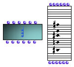

OpenMusic Reference  
---  
[Prev](classref.main)| | [Next](chord-seq)  
  
* * *

# Chord

  
  
Chord  
  
(score module) \--  

## Syntax

   **Chord**   self lmidic lvel ldur lchan   

## Slots

name| data type(s)| comments  
---|---|---  
  _self_ | [ **Chord**](chord) object, [**Note**](note) object, list of [**Note**](note)s, a midic, a list of midics|  
  _lmidic_ |  list of midics|  
  _lvel_ |  list of integers between 0 and 127|  
  _loffset_ |  list of offsets in milliseconds|  
  _ldur_ |  list of durations in milliseconds|  
  
## Notes

[ **Chord**](chord) has a graphic editor described in detail in the
[Editors Reference](editors.notation)

* * *

[Prev](classref.main)| [Home](index)| [Next](chord-seq)  
---|---|---  
Class Definitions| [Up](classref.main)| Chord-seq

