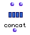
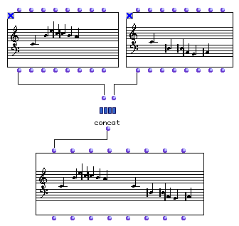
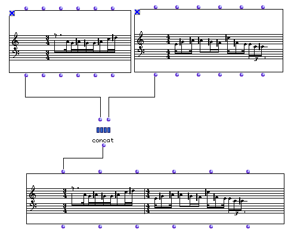

OpenMusic Reference  
---  
[Prev](card)| | [Next](conditional)  
  
* * *

# concat

  
  
concat  
  
(score module) \-- appends one OM music class to another  

## Syntax

`` **concat**` s1 s2 `

## Inputs

name| data type(s)| comments  
---|---|---  
` _s1_`|  an OM score class object| see description  
` _s2_`|  an OM score class object| see description  
  
## Output

output| data type(s)| comments  
---|---|---  
first| an OM music class object| ` _s1_` appended to `_s2_`  
  
## Description

This function appends one music object to another. `_s2_` is stuck onto the
back of `_s1_`. The data types permitted at the two inputs and the result are
summarized in the following table:

object type at `_s1_`|  object type at `_s2_`|  object type returned  
---|---|---  
 **Voice**|  **Voice**|  **Voice**  
 **Measure**|  **Voice**|  **Voice**  
 **Voice**|  **Measure**|  **Voice**  
 **Multi-seq**|  **Multi-seq**|  **Multi-seq**  
 **Chord-seq**|  **Chord-seq**|  **Chord-seq**  
 **Poly**|  **Poly**|  **Poly**  
  
In order to concatenate a **Voice** with a **Chord-seq** you should pass the
**Voice** through a **Chord-seq** object or the **Chord-seq** through a
**Voice** object first.

The `concat` function is the opposite of [`select`](concat).

## Examples

### Demonstrating `concat`

Two **Chord-seq** s being concatenated.

Two **Voice** s being concatenated.

* * *

[Prev](card)| [Home](index)| [Next](conditional)  
---|---|---  
card| [Up](funcref.main)| conditional

