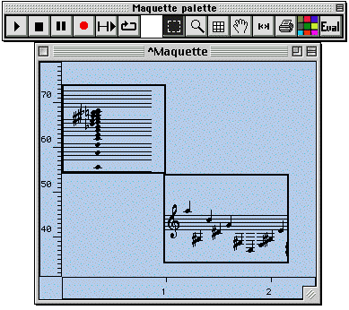

OpenMusic Reference  
---  
[Prev](x1601)| | [Next](x1840)  
  
* * *

# Chapter 10. Maquettes

 **Table of Contents**

[The structure of a [**Maquette**](glossary#MAQUETTE)](x1840)

    

[Objects in the [**Maquette**](glossary#MAQUETTE)
frame](x1840#AEN1844)

[The [**Maquette**](glossary#MAQUETTE) frame](x1840#AEN1922)

[The General Palette](x1840#AEN1938)

[Contextual menus](x1840#AEN2078)

[The Metric Ruler](x1840#AEN2114)

[Markers](x1840#AEN2134)

[The [**Temporalbox**](temporalbox) object](temporalbox)

[[ **Maquette**](glossary#MAQUETTE)s in patches](x2212)

|

For those curious, _maquette_ is a French word which translates as _model_ or
_sketch_.  
  
---|---  
  
The [**Maquette**](glossary#MAQUETTE) is a special container object which
incorporates a time element. A [**Maquette**](glossary#MAQUETTE) can
contain any musical object, but can also contain a special object called
[**Temporalbox**](temporalbox). These boxes can contain other patches and
even other [**Maquette**](glossary#MAQUETTE)s.

Any OM playable musical object may be put in a
[**Maquette**](glossary#MAQUETTE), as may MIDI files, AIFF files, other
[**Maquette**](glossary#MAQUETTE)s. When these objects are dropped into a
[**Maquette**](glossary#MAQUETTE) they are represented by boxes in the
frame. Double-clicking the box opens a graphic editor for the object
associated with it. You may also drop whole patches into a
[**Maquette**](glossary#MAQUETTE), in which case they are automatically
enclosed in a special object called a TEMPORALBOX, described below. Objects in
the [**Maquette**](glossary#MAQUETTE) are placed in time, along the
x-axis, and are played in that order. In addition, if the object is a patch,
(within a [**Temporalbox**](temporalbox)) it has access to information
about its placement and shape within the frame of the
[**Maquette**](glossary#MAQUETTE), and these quantities can thus be used
to change the way the patch behaves. This information comes into the
[**Temporalbox**](temporalbox) through the outputs of the special
 _self_  object. In addition, you can create your own inputs and outputs
between [**Temporalbox**](temporalbox)es which can carry other data
between them.

Finally, the output of a [**Maquette**](glossary#MAQUETTE) may be saved
directly as a midi file using the [ save-as-midi ](save-as-midi)
function.

* * *

[Prev](x1601)| [Home](index)| [Next](x1840)  
---|---|---  
Creating a new class| [Up](concepts)| The structure of a
[**Maquette**](glossary#MAQUETTE)

