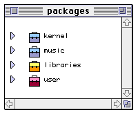
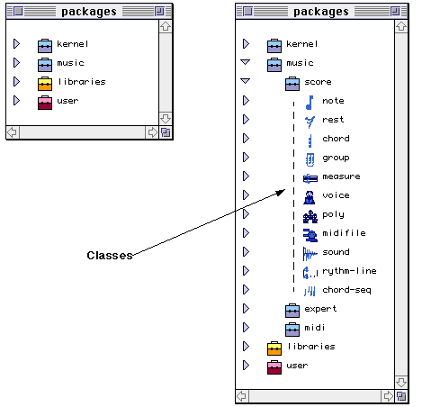

OpenMusic Reference  
---  
[Prev](x1005)| | [Next](x1089)  
  
* * *

# Chapter 4. Packages

 **Table of Contents**

[Managing Classes](x1089)

    

[Inheritance](x1089#AEN1098)

[Slots](x1089#AEN1115)

[Initialization methods](x1089#AEN1135)

[Managing Functions](x1143)

The packages folder is the place where OM function and class definitions and
classes are stored. Classes are the models from which new objects are created.
Functions are operations performed on classes. Both classes and functions are
represented in by icons, which can be dragged from the packages folder to the
Workspace for use.

The package concept is inspired by the Java [_programming
language_](glossary#PROGRAMMING-LANGUAGE). It is a place where related
functionalities are stored together. A package is represented by a suitcase
icon with two parts, an upper, lighter colored part, and a lower, darker
colored part. These two parts give access to different aspects of the package.
Packages can have subpackages. You'll be able to create your own subpackages
in the user package, and fill them with your own classes and functions.

Though they may contain any number of packages, all OM packages folders must
contain at least the four basic packages: kernel, music, libraries, and user.
Double clicking opens the packages folder:

Kernel stores functions and class definitions for the LISP kernel, the
foundation on which OM is built. Here you will find the data types and
functions for mathematical calculations, basic data processing and list
management.

The music suitcase stores the functions and classes particular to OM, i.e. all
the playable musical objects and the functions which act on them.

The libraries folder holds classes and functions for any libraries available
to OM. A library is a stand-alone module of class and function definitions
grouped into a suitcase. Before you can access these functions and classes,
you must load the library by double-clicking the lower half of the suitcase
icon, after which the suitcase opens and you can view the contents. The
functions and classes of the suitcases will also become available in the
Functions and Classes menu bar when in the patch window.

The user folder holds class and function definitions created by you, O great
user.

In order to view their contents, packages may be expanded with the icon to
their left or opened in in a separate window by clicking in the **lower** ,
darker portion of the suitcase icon.

* * *

[Prev](x1005)| [Home](index)| [Next](x1089)  
---|---|---  
Object states| [Up](concepts)| Managing Classes

