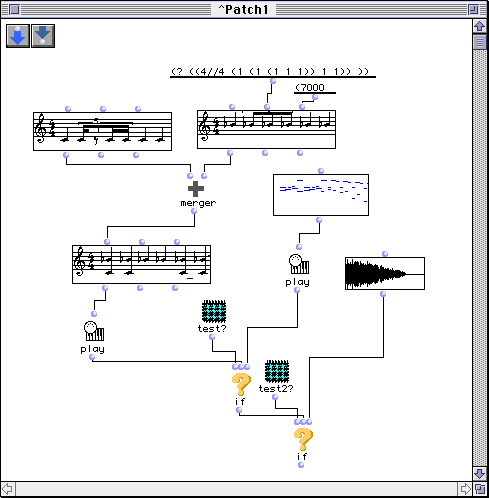

OpenMusic Reference  
---  
[Prev](x708)| | [Next](x786)  
  
* * *

# Chapter 3. Patches

 **Table of Contents**

[The in-line documentation](x786)

[Patches in the Workspace](x831)

[Patch structure](x844)

    

[Inputs and outputs](x844#AEN854)

[Objects within the patch](x844#AEN881)

[Making connections within the patch](x844#AEN914)

[Evaluating patches](x844#AEN936)

[Manipulating icons in the Patch Window](x844#AEN954)

[Abstractions](x966)

[Contextual menus](x982)

[Object states](x1005)

A patch is the basic unit of OM object-oriented programming. Within a patch,
you create a flowchart which graphically describes
[_LISP_](glossary#LISP) code accomplishing a specific function. The
primary building blocks of patches are [functions](concepts.functions)
and [classes](concepts.classes) although other objects are used, albeit
more rarely:

Here we see some of the possible contents of a patch: OM musical objects with
a graphic view of their contents, OM functions [`merger`](merger),
[`play`](play), etc., numerical values (7000 and the rhythm tree above),
external MIDI and sound files with graphic representations of their contents,
and other patches `test?` and `test2?`.

* * *

[Prev](x708)| [Home](index)| [Next](x786)  
---|---|---  
Manipulating Items in the Workspace| [Up](concepts)| The in-line
documentation

