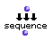

OpenMusic Reference  
---  
[Prev](concat)| | [Next](cons)  
  
* * *

# conditional

  
  
conditional  
  
(control module) \-- evaluates a series of patches, returning the first non-
nil value  

## Syntax

`` **conditional**` test &rest addtest `

## Inputs

name| data type(s)| comments  
---|---|---  
` _test_`|  any|  
` _addtest_`|  any| repeatable; additional patches to evaluate  
  
## Output

output| data type(s)| comments  
---|---|---  
first| any| the results of the first patch returning a non-nil value  
  
## Description

`conditional` takes as many inputs as needed. They can be of any data type,
and will be evaluated from left to right. The first patch returning a value
other than nil is passed to the output. If all the evaluations return nil, nil
is returned. This function is generally used with [`omif`](omif).

## Examples

### Using `conditional` with `omif`.

Here, the value 2 is passed to four different `omif` functions comparing it
with the values 0-3. Only the third `omif` will return the name associated
with it, the rest will return nil. `conditional` will thus return the value at
its third input:

`? OM->sylvie`

Connecting a different number to the inputs of the `omif` functions will
change the output to another of the associated names.

* * *

[Prev](concat)| [Home](index)| [Next](cons)  
---|---|---  
concat| [Up](funcref.main)| cons

