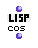

OpenMusic Reference  
---  
[Prev](cons)| | [Next](create-list)  
  
* * *

# cos

  
  
cos  
  
(lisp module) \-- returns the cosine of `_radians_`  

## Syntax

`` **cos**` radians `

## Inputs

name| data type(s)| comments  
---|---|---  
` _radians_`|  a number| the angle whose cosine to compute, in radians  
  
## Output

output| data type(s)| comments  
---|---|---  
first| a number|  
  
## Description

Computes the cosine of the angle `_radians_` , expressed in radians.

* * *

[Prev](cons)| [Home](index)| [Next](create-list)  
---|---|---  
cons| [Up](funcref.main)| create-list

