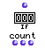
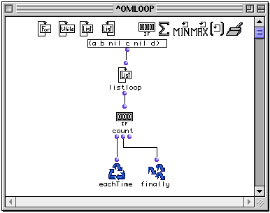
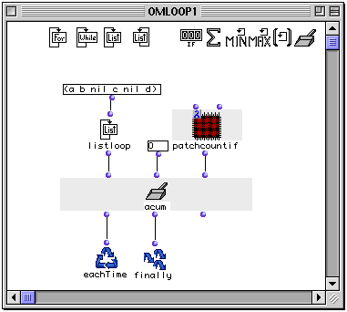
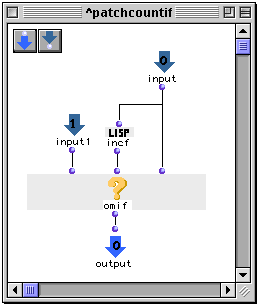

OpenMusic Reference  
---  
[Prev](onlistloop)| | [Next](sum)  
  
* * *

# counter (count)

  
  
counter (count)  
  
(control module) \-- registers the number of times  _what?_  has a non-nil
value  

## Syntax

   **counter**  what? &optional retard  

|

Though it is called  counter  in its LISP code, this function appears as
 count  when used inside  omloop . The reason eludes me.  
  
---|---  
  
## Inputs

name| data type(s)| comments  
---|---|---  
  _what?_ |  any|  
  _retard_ |  a function name or lambda function|  
  
## Output

output| data type(s)| comments  
---|---|---  
first| an integer| triggers the collection  
second| an integer| returns the state of the collection without evaluation  
third| 0| reinitializes the counter, resetting it to zero  
  
## Description

|

 counter  is part of a group of functions for performing iterative
[loops](glossary#LOOP). They can only be used within an
[omloop](omloop) patch window. Since they only function within the
context of the entire repeating loop, they (or any function connected to them)
cannot be evaluated directly within the patch window. You must evaluate the
entire loop. See the entry on  omloop  for more information.  
  
---|---  
  
 counter  is a type of collector. It adds registers the number f times
 _what?_  has a non-nil value.

Like all collectors,  counter  has three outputs:

The first output triggers the counter, evaluating whatever is connected to it
and causing the counter to increase by 1 if that value is non-nil. It is
usually connected to  eachTime . The value carried by the connection itself is
the current state of the counter, which you can verify by placing the lisp
function  print  between the first output and  eachTime .

The second output returns the current state of counter, without evaluating
whatever is connected to it. It is usually connected to  finally  so that you
can get the results of the count.

The third output reinitializes the counter, resetting it to zero. The value
carried by the connection is always 0.

## Examples

|  **About the collectors**  
---|---  
 |

 counter  is a type of collector. The most generalized type of collector is
the function  accumulator . Some collectors are special versions of the
 accumulator  function. In these cases, the example of the use of the specific
collector is reproduced with accumulator to illustrate this. The reader is
therefore advised to read the entry on [ accumulator ](accumulator)
before continuing.  
  
### Using  counter 

The list of six values (a b nil c nil d) contains nil twice and non-nil
elements four time.  listloop  will enumerate the values one by one and pass
them to  counter . Running this loop will cause counter to report:

 ? OM->4 

### Reproducing  counter  with  accumulator 

We will set up  accumulator  to perform exactly the same function. The
 listloop  output of (a b nil c nil d) is run into the first input. We set the
initial value to zero and connect a special lambda patch to the  _fun_  input.
It is this custom-made patch that will do the work of  counter . It has the
following internal structure:

The elements sent by  listloop  are at input 1. They are connected right to
 omif , which will use the LISP function  incf  to add one to the internal
state of the collector (coming into input zero) every time a non-nil element
is received. The two nil elements of the list cause input zero to be passed
without changing it, and the stored result will thus not be incremented.

* * *

[Prev](onlistloop)| [Home](index)| [Next](sum)  
---|---|---  
onlistloop| [Up](funcref.omloop)| sum

