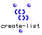
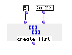

OpenMusic Reference  
---  
[Prev](cos)| | [Next](ctrlchg)  
  
* * *

# create-list

  
  
create-list  
  
(lists module) \-- Returns a list of  _count_  instances of  _elem_   

## Syntax

   **create-list**  count elem  

## Inputs

name| data type(s)| comments  
---|---|---  
  _count_ |  a non-negative integer. defaults to 10|  
  _elem_ |  any|  
  
## Output

output| data type(s)| comments  
---|---|---  
first| a list or tree|  
  
## Description

Constructs a list with  _count_  repetitions of whatever is given at the
 _elem_  input. If  _count_  is set to 0, nil is returned.

## Examples

### Creating a repeating list

Returns:

 ? OM->((a 2) (a 2) (a 2) (a 2) (a 2)) 

* * *

[Prev](cos)| [Home](index)| [Next](ctrlchg)  
---|---|---  
cos| [Up](funcref.main)| ctrlchg

