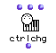

OpenMusic Reference  
---  
[Prev](create-list)| | [Next](decompo)  
  
* * *

# ctrlchg

  
  
ctrlchg  
  
(midi module) \-- sends a MIDI Control Mode Change message  

## Syntax

   **ctrlchg**  ctrlnum values chans &optional port  

## Inputs

name| data type(s)| comments  
---|---|---  
  _ctrlnum_ |  an integer|  
  _values_ |  an integer|  
  _chans_ |  an integer or list thereof|  
  _port_ |  an integer or list thereof| The MIDI port(s) to send on  
  
## Output

output| data type(s)| comments  
---|---|---  
first| nil| This output will always return nil; the data is sent out anyway.  
  
## Description

This module is used to send Control Mode Change messages (also called
controller changes) to MIDI equipment. The MIDI standard includes controllers
for things like vibrato depth, sustain pedal, LFO frequency cutoff, generic
continuous controllers, as well as a group of undefined controllers whose
function is left up to you.

|  **OM and MIDI**  
---|---  
 |

OM can be configured to communicate with any [_MIDI_](glossary#MIDI)
device. See the chapter on [configuring Midishare](getting-started.install-
midishare) for more information.  
  
* * *

[Prev](create-list)| [Home](index)| [Next](decompo)  
---|---|---  
create-list| [Up](funcref.main)| decompo

