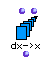
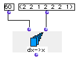
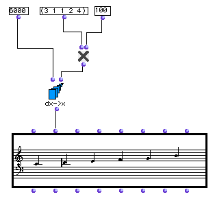

OpenMusic Reference  
---  
[Prev](denominator)| | [Next](equal)  
  
* * *

# dx->x

  
  
dx->x  
  
(series module) \-- constructs a list of numbers from  _start_  with intervals
given by  _list_ .  

## Syntax

   **dx- >x**  start list  

## Inputs

name| data type(s)| comments  
---|---|---  
  _start_ |  a number| the starting point of the new list  
  _list_ |  a list of numbers| the intervals between elements of the new list  
  
## Output

output| data type(s)| comments  
---|---|---  
first| a list of numbers|  
  
## Description

This function is the complement of  x->dx 

 dx->x  takes its name from the mathematical notation for the change over time
in a given quantity. This change in time is usually symbolized by the greek
letter delta: Δ. It is also notated with a _d_ and the variable whose change
over time is being measured, frequently _x_ , i.e. _dx_.

 dx->x  takes a list of relative intervals and converts it into a series of
absolute values starting at  _start_ . The list returned will thus have one
more element than the list input.

## Examples

### Reconstructing a series from a list of deltas

The function will start at 60 and add the numbers in  _list_  consecutively,
with the result:

 ? OM->(60 62 64 65 67 69 71 72) 

### Reconstructing a melody from a list of intervals

Here we reconstruct the melody of the example given in the reference for
[ x->dx ](x-dx).

A list of intervals in semitones, (3 1 1 2 4), is passed to the function along
with the starting point, middle C (whose [midic](glossary#MIDIC) is
6000), after being multiplied by 100 to convert them to midics.

They are converted into values relative to the initial note, midic 6000 (6000
6300 6400 6500 6700 7100) and then passed to the  _lmidic_  input of the
**Chord-seq** object. The melody is reconstructed.

* * *

[Prev](denominator)| [Home](index)| [Next](equal)  
---|---|---  
denominator| [Up](funcref.main)| equal

