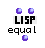

OpenMusic Reference  
---  
[Prev](dx-x)| | [Next](expand-lst)  
  
* * *

# equal

  
  
equal  
  
(lisp module) \-- returns t if the inputs are equivalent expressions  

## Syntax

`` **equal**` object1 object2 `

## Inputs

name| data type(s)| comments  
---|---|---  
` _object1_`|  any|  
` _object2_`|  any|  
  
## Output

output| data type(s)| comments  
---|---|---  
first| t or nil|  
  
## Description

`equal` returns true when object1 and object2 are structurally similar. A
rough rule of thumb is that objects are equal when their printed
representation is the same. `equal` is case sensitive when comparing strings
and characters.

* * *

[Prev](dx-x)| [Home](index)| [Next](expand-lst)  
---|---|---  
dx->x| [Up](funcref.main)| expand-lst

