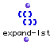
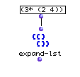
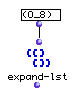
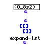
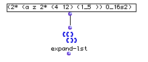

OpenMusic Reference  
---  
[Prev](equal)| | [Next](f-mc)  
  
* * *

# expand-lst

  
  
expand-lst  
  
(lists module) \-- returns a list expanded from a special syntax  

## Syntax

   **expand-lst**  list  

|

The function name contains no letter 'i'. Be sure to type it correctly  
  
---|---  
  
## Inputs

name| data type(s)| comments  
---|---|---  
  _list_ |  a tree| written in a special syntax understood by certain OM
functions. See below  
  
## Output

output| data type(s)| comments  
---|---|---  
first| a list or tree| the expanded list  
  
## Description

Constructs a list of repeating patterns according to one or both of the
following expressions:

<number>* (x1 ...x2)

repeats the pattern x1...x2 <number> times.

<n>_<m>s<k>

appends an arithmetic series counting from <n> to <m> by step <k>. When s<k>
is omitted, k is assumed to be 1.

## Examples

### The  expand-lst  syntax

Returns:

 ? OM->(2 4 2 4 2 4) 

The 3* indicates that what is between the parentheses that follow will be
repeated 3 times.

Returns:

 ? OM->(0 1 2 3 4 5 6 7 8) 

The underscore indicates that the integers between the 0 and the 8 will
enumerated.

Returns:

 ? OM->(0 2 4 6 8) 

The addition of the 's' means that the series will be counted by whatever
follows instead of one; in this case, 2.

Returns:

 ? OM->? OM->(a z 4 12 4 12 (1 2 3 4 5) a z 4 12 4 12 (1 2 3 4 5) 0 2 4 6 8 10
12 14 16) 

The  _expand-lst_  syntax permits nesting. When nesting is present, the
expression furthest into the prentheses is evaluated first, in this case, 1_5,
which generates (1 2 3 4 5), which, along with 'a z' and 4 12 (itself repeated
twice) is repeated twice (indicated by the 2* at the beginning of the
expression. This whole mess is followed by 0_16s2, which represents the
integers between 0 and 16, counting by 2.

* * *

[Prev](equal)| [Home](index)| [Next](f-mc)  
---|---|---  
equal| [Up](funcref.main)| f->mc

