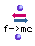

OpenMusic Reference  
---  
[Prev](expand-lst)| | [Next](factorize)  
  
* * *

# f->mc

  
  
f->mc  
  
(conversions module) \-- converts frequencies in Hertz (Hz) to approximate
midicent pitches  

## Syntax

`` **f- >mc**` freq &optional approx ref-midic `

## Inputs

name| data type(s)| comments  
---|---|---  
` _freq_`|  a number or list thereof| the frequency or list of frequencies to
convert  
` _approx_`|  a positive number| optional; the subdivision of the octave to
use for the approximation; defaults to 2. Note that decimal values are allowed  
` _ref-midic_`|  an integer| optional; specifies a reference pitch, as a midic  
  
## Output

output| data type(s)| comments  
---|---|---  
first| a number or list thereof|  
  
## Description

This function accepts either a single frequency or a list of frequencies. They
will be converted into their nearest approximation in
[_midic_](glossary#MIDIC) values.

If the optional inputs are not used, the approximation will be as close as
possible. If `_approx_` is used, they will be rounded off to their nearest
note in an equal-tempered subdivision of the octave. The octave of 1200 midics
will be subdivided into (` _approx_` *6) equal parts, and the values will be
rounded to these numbers. The default value of 2 for `_approx_` produces a
traditional twelve-tone octave. 1 will produce a whole-tone, 6-step
subdivision. 4 will produce a quarter-tone, 24-step division, and 8 will
produce an eighth-tone, 48-step division of the octave. Other integers may be
entered if desired do divide the octave in other ways.

The optional `_ref-midic_` input allows you to specify a reference pitch, in
midics. This pitch will be subtracted from all the midics after they are
converted from the frequencies, but before the approximation is performed, and
the resulting midics will thus be relative to this midic.

* * *

[Prev](expand-lst)| [Home](index)| [Next](factorize)  
---|---|---  
expand-lst| [Up](funcref.main)| factorize

