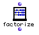

OpenMusic Reference  
---  
[Prev](f-mc)| | [Next](famille)  
  
* * *

# factorize

  
  
factorize  
  
(arithmetic module) \-- returns the prime decomposition of a number  

## Syntax

`` **factorize**` number `

## Inputs

name| data type(s)| comments  
---|---|---  
` _number_`|  a number| though this input will accept any kind of number, the
function only works correctly for positive integers  
  
## Output

output| data type(s)| comments  
---|---|---  
first| a tree| returns the prime decomposition of `_number_`  
  
## Description

This function returns a tree in the form ((x,y)...) where x is a prime factor
of `_number_` and y is an exponent of that prime factor. The primes known to
the system are the 1230 primes ranging from 1 to 9973.

|

Any number can be represented as a product of prime numbers. For example, 21
can be decomposed into 3*7. 45 can be represented as 3*3*5. This sequence of
prime numbers is unique for any given number. Because of this, factorization
has many applications, especially in cryptography.  
  
---|---  
  
* * *

[Prev](f-mc)| [Home](index)| [Next](famille)  
---|---|---  
f->mc| [Up](funcref.main)| famille

