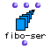

OpenMusic Reference  
---  
[Prev](famille)| | [Next](finale-export)  
  
* * *

# fibo-ser

  
  
fibo-ser  
  
(series module) \-- generates a fibonacci series  

## Syntax

   **geometric-ser**  seed1 seed2 limit &optional begin end  

## Inputs

name| data type(s)| comments  
---|---|---  
  _seed1_ |  a number| the first element from which to calculate the series. Defaults to 0  
  _seed2_ |  a number| the second element from which to calculate the series. Defaults to 1  
  _limit_ |  a number| the upper limit of the series. Defaults to 10  
  _begin_ |  a non-negative integer| optional; the ordinal of the first term to take. Defaults to 0  
  _end_ |  a non-negative integer| optional; the ordinal of the last term to take. Defaults 536870911  
  
## Output

output| data type(s)| comments  
---|---|---  
first| a list|  
  
## Description

Returns a [fibonacci series](glossary#FIBONACCI-SERIES) series.

 fibo-ser  produces a list of terms starting with  _seed1_  and  _seed2_  and
produces new terms by adding the previous two, until the series reaches
 _limit_  or would exceed  _limit_  in its next term.

Additionally, you can specify two optional inputs  _begin_  and  _end_  ,
which will cause  fibo-ser  to return only the range of elements of the series
between the two inputs (just like [ geometric-ser ](geometric-ser)

## Examples

### Calculating a fibonacci sequence

Here we see  fibo-ser  set to produce a fibonacci series stopping at or before
reaching 250. It returns

 ? OM->(0 1 1 2 3 5 8 13 21 34 55 89 144 233) 

* * *

[Prev](famille)| [Home](index)| [Next](finale-export)  
---|---|---  
famille| [Up](funcref.main)| finale-export

