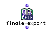

OpenMusic Reference  
---  
[Prev](fibo-ser)| | [Next](finale-import)  
  
* * *

# finale-export

  
  
finale-export  
  
(score module) \-- Puts a [**Voice**](voice) or [**Poly**](poly)
object on the clipboard so that Finale can import it.  

## Syntax

`` **finale-export**` self &optional temperament `

## Inputs

name| data type(s)| comments  
---|---|---  
` _self_`|  A [**Voice**](voice) or [**Poly**](poly) object|  
` _temperament_`|  Either 2, 4, or 8|  
  
## Output

output| data type(s)| comments  
---|---|---  
first| t|  
  
## Description

This function puts the connected [**Voice**](voice) or
[**Poly**](poly) object on the clipboard. Once there, it can be brought
into the Finale notation program by selecting Composer's Assitant->Import from
OpenMusic. The object will appear in extra staves added to the bottom of the
document.

The optional `_temperament_` input is used to set the resolution of the
export: 2 for semitone, 4 for quartertone, 8 for eighthtone.

This function always returns t in the Listener. This indicates that the export
is performed.

* * *

[Prev](fibo-ser)| [Home](index)| [Next](finale-import)  
---|---|---  
fibo-ser| [Up](funcref.main)| finale-import

