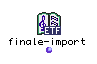

OpenMusic Reference  
---  
[Prev](finale-export)| | [Next](first)  
  
* * *

# finale-import

  
  
finale-import  
  
(score module) \-- Takes a Finale clipping and puts it into a
[**Voice**](voice) or [**Poly**](poly) object.  

## Syntax

   **finale-import**   

## Inputs

This function has no inputs in OM.

## Output

output| data type(s)| comments  
---|---|---  
first| A [**Poly**](poly) object |  
  
## Description

This function takes a clipping created within the Finale notation program by
selecting Composer's Assitant->Export to OpenMusic and transforms it into a
[**Poly**](poly) object, which should be connected to its output. You may
also use a [**Voice**](voice) object, if your Finalee clipping is only
from one staff.

This function always returns t in the Listener. This indicates that the import
is performed.

* * *

[Prev](finale-export)| [Home](index)| [Next](first)  
---|---|---  
finale-export| [Up](funcref.main)| first

