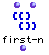

OpenMusic Reference  
---  
[Prev](first)| | [Next](flatlisp)  
  
* * *

# first-n

  
  
first-n  
  
(lists module) \-- returns the first _n_ elements of a list  

## Syntax

   **first-n**  list n  

## Inputs

name| data type(s)| comments  
---|---|---  
  _list_ |  a tree|  
  _n_ |  a non-negative integer|  
  
## Output

output| data type(s)| comments  
---|---|---  
first| a tree|  
  
## Description

Returns the first  _n_  elements of the  _list_ . If  _n_  is longer than the
length of  _list_  , the entire list is returned.

|

This function is _not_ identical to the LISP function  first .  first-n 
always returns a list even if asked to return just one element.  
  
---|---  
  
* * *

[Prev](first)| [Home](index)| [Next](flatlisp)  
---|---|---  
first| [Up](funcref.main)| flat

