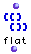
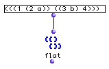
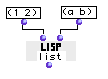

OpenMusic Reference  
---  
[Prev](first-n)| | [Next](floor)  
  
* * *

# flat

  
  
flat  
  
(lists module) \-- removes imbrication (nesting) from lists  

## Syntax

`` **flat**` lst &optional level `

## Inputs

name| data type(s)| comments  
---|---|---  
` _lst_`|  a tree|  
` _level_`|  a non-negative integer|  
` _lst?_`|  any|  
  
## Output

output| data type(s)| comments  
---|---|---  
first| a tree|  
  
## Description

Returns a copy of list with parentheses removed. By default, `flat` removes
all levels of [nesting](glossary#NESTING), returning a list whose only
parentheses are those which enclose it, a 'flat' list.

When the optional input is used, only `_level_` levels of parentheses are
removed, starting from the outside. Setting `_level_` to 0 will thus return
the list unchanged. Leaving `_level_` at nil will remove all levels of
nesting.

## Examples

### Flattening a list

Here, the list is flattened completely:

`? OM->(1 2 a 3 b 4)`

Here, the optional input `_level_` has been set to 2. Only the two outside
levels of nesting have been removed, leaving one intact:

`? OM->(1 (2 a) (3 b) 4)`

* * *

[Prev](first-n)| [Home](index)| [Next](floor)  
---|---|---  
first-n| [Up](funcref.main)| floor

