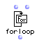
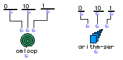
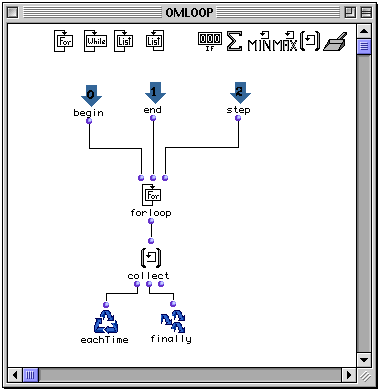
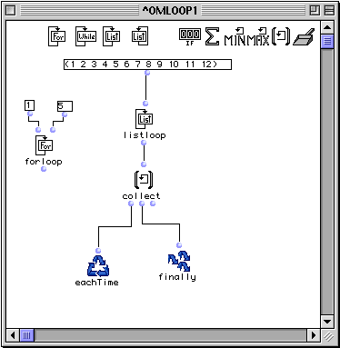

OpenMusic Reference  
---  
[Prev](omloop)| | [Next](whileloop)  
  
* * *

# forloop

  
  
forloop  
  
(control module) \-- sets the number of repetitions in  omloop   

## Syntax

   **forloop**  from to &optional by  

## Inputs

name| data type(s)| comments  
---|---|---  
  _from_ |  a number| defaults to 0  
  _to_ |  a number| defaults to 10  
  _by_ |  a positive number| optional; defaults to 1  
  
## Output

output| data type(s)| comments  
---|---|---  
first| a number| the current value of the  forloop   
  
## Description

|

 listloop  is part of a group of functions for performing iterative
[loops](glossary#LOOP). They can only be used within an
[omloop](omloop) patch window. Since they only function within the
context of the entire repeating loop, they (or any function connected to them)
cannot be evaluated directly within the patch window. You must evaluate the
entire loop. See the entry on  omloop  for more information.  
  
---|---  
  
 forloop  sets the maximum number of times  omloop  will execute before
returning its value. At each repetition,  forloop  returns an number between
 _from_  and  _to_ . On the first repetition, it will be  _from_ . On the
second, it will be  _from_  +1, on the third  _from_  +2 and so on.  forloop 
stops the loop when its value exceeds  _to_ .

Using the optional input  _by_  replaces the 1 which is added each time by the
number of your choice, which need not be an integer.

 ** forloop  will not function correctly unless  _by_  is positive.** That is,
you cannot step backwards through numbers, for example from 4 to -1 by
increments of -1. This is because a negative stepping requires setting
 _from_  to _more_ than  _to_  , meaning that the starting value is already
greater than  _to_  and  forloop  stops loop execution immediately.

## Examples

### Constructing an arithmetic series, Part Deux

Here we will use  omloop  to duplicate the output of the box [ arithm-
ser ](arithm-ser):

We will do this using the  forloop  iterator. The  forloop  outputs 0 on the
first repetition, 1 on the second, etc., until it reaches 11. When 11 is
reached  forloop  causes the loop to end, and the results of the accumulator
 collect  are returned:

 ? OM->(0 1 2 3 4 5 6 7 8 9 10) 

### Combining  forloop  and another iterator

Iterator functions may be combined in the same loop. In this case, Here we
will use  forloop  in combination with  listloop :

When two iterators are combined, the loop will end when _either_ of the two
finishes. Here,  listloop  will sequentially enumerate the list of 12
elements.  forloop , however, is set to return only the numbers from 1 to 5,
inclusive, before stopping the loop. **Note that forloop does not have to be
connected to anything; it will enumerate the numbers between  _from_  and
 _to_  , regardless.**  forloop  will thus finish before  listloop , and so
only the first five elements of the list will be collected by  collect :

 ? OM->(1 2 3 4 5) 

* * *

[Prev](omloop)| [Home](index)| [Next](whileloop)  
---|---|---  
omloop| [Up](funcref.omloop)| whileloop

