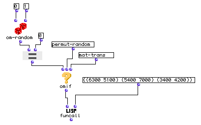
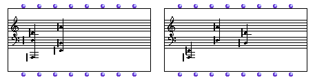
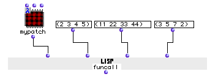
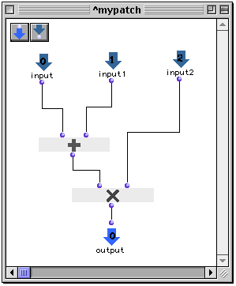

OpenMusic Reference  
---  
[Prev](floor)| | [Next](geometric-ser)  
  
* * *

# funcall

  
  
funcall  
  
(LISP function) \-- returns the result of the evaluation of  _function_   

## Syntax

   **funcall**  function &restarguments  

## Inputs

name| data type(s)| comments  
---|---|---  
  _function_ |  symbol, function name or lambda function | the function that
will be evaulated  
  _arguments_ |  any| repeatable; data is passed to  _function_  as arguments  
  
## Output

output| data type(s)| comments  
---|---|---  
first| any| the result of the evaluation  
  
## Description

Calls  _function_  , passing it  _arguments_  as inputs, in the order entered.
It is as if the arguments of  funcall  were plugged in, left to right, to
 _function_ . The result, is returned.

  _function_  may be a symbol, a function name, or function in lambda mode.
Note that if you pass a function in lambda mode with repeatable inputs, you
must add the correct number to accomodate the number of arguments you are
passing it at the other inputs. This is not necessary if the function name is
entered directly instead of its icon in lambda mode.

 funcall  is similar to [ apply ](apply) in operation. The difference is
that  funcall  passes all of its inputs as single arguments, where  apply 
treats the last input specially, passing its elements individually to
 _function_ .

 funcall  only calls  _function_  once. If you need to call a function
multiple times to process data in a list or lists, consider using
[ mapcar ](mapcar) or [ mapcan ](mapcan).

|  **LISP functions**  
---|---  
 |

The basic LISP functions are too numerous to document comprehensively in this
manual. As an aid to the neophyte, the most commonly used have been included
in this documentation, but they represent a small fraction of the total
functionality of the [MCL](glossary#MCL) environment. Numerous on-line
resources exist, for instance the [online version of _Common Lisp the
Language, 2nd Edition_.](http://www-2.cs.cmu.edu/afs/cs.cmu.edu/project/ai-
repository/ai/cltl/clm/)  
  
## Examples

### Using  funcall  to transform chords

Here  funcall  is used in conjunction with a random element to transform pitch
material. Our pitch material is six pitches, grouped into three groups of two
pitches each. This is the data that will be passed to whichever function is
chosen by the  omif  module, which will choose one or the other based on the
results of the 'random' number generated by  om-random.  If it is 0 then the
first function, [ permut-random ](permut-random) will be selected. If it
is one, the second, [ mat-trans ](mat-trans) will be passed to  funcall .
The result is plugged into a **Chord-seq** object and visualized as musical
notation.

 permut-random  will randomly re-order the groups of two; this will result in
a change in the order of the two-note chords.  mat-trans  will recombine the
three groups of two into two groups of three. The result will be two three-
note chords instead of 3 pairs of notes.

Two possible outcomes are shown below, the first being the result of the  mat-
trans , the second of  permut-random .

### Using a lambda patch to combine multiple functions with  funcall 

These three lists will be passed as inputs 1, 2 and 3 to the patch  mypatch 
in lambda mode. The inside of  mypatch  looks like this:

The elements of lists one and two will be paired off and added, and the
elements of the resulting list will be paired off and multiplied by the
elements of list three. The result returned by this function call is:

 ? OM->(39 125 259 98) 

* * *

[Prev](floor)| [Home](index)| [Next](geometric-ser)  
---|---|---  
floor| [Up](funcref.main)| geometric-ser

