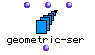
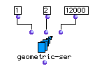
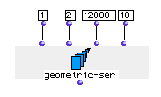

OpenMusic Reference  
---  
[Prev](funcall)| | [Next](get-chords)  
  
* * *

# geometric-ser

  
  
geometric-ser  
  
(series module) \-- generates a geometric series  

## Syntax

   **geometric-ser**  seed factor limit &optional nummax begin end  

## Inputs

name| data type(s)| comments  
---|---|---  
  _seed_ |  a number| the starting point of the series  
  _factor_ |  a number| the multiplicative coefficient of the series  
  _limit_ |  a number| the upper limit of the series  
  _nummax_ |  a non-zero integer| optional; the maximum number of terms
produced. Defaults to 10  
  _begin_ |  a non-negative integer| optional; the ordinal of the first term
to take  
  _end_ |  a non-negative integer| optional; the ordinal of the last term to
take  
  
## Output

output| data type(s)| comments  
---|---|---  
first| a list|  
  
## Description

Returns a geometric series. An geometric series is a series in which the next
term is produced by multiplying the previous term in the series by a fixed
number.

 gemoetric-ser  produces a list of terms starting at  _seed_  and produces new
terms by multiplying each successive term by  _factor_  until the series
reaches  _limit_  or would exceed  _limit_  in its next term.

The optional input  _nummax_  allows you to limit the number of terms in the
series. When it is set, the series will have a maximum of (  _nummax_  plus 1)
terms. It will still end on or before  _end_  , however.

Additionally, you can specify two optional inputs  _begin_  and  _end_  ,
which will cause  geometric-ser  to return only the range of elements of the
series between the two inputs.

When  _limit_  ,  _nummax_  ,  _begin_  and  _end_  specify different ending
points for the series, the priority for determining the length of the list is
given first by  _limit_  , then the terms between  _begin_  and  _end_  , and
then with  _nummax_ .

## Examples

### Limiting the range of a geometric series with  geometric-ser 

Here we see  geometric-ser  set to produce a series of powers of 2 stopping at
or before reaching 12000. It returns

 ? OM->(1 2 4 8 16 32 64 128 256 512 1024 2048 4096 8192) 

Setting  _nummax_  to 10, we limit the series to 11 elements, even though
 _limit_  is set to 12000:

it returns:

 ? OM->(1 2 4 8 16 32 64 128 256 512 1024) 

Finally, if we set  _begin_  to 8 and  _end_  to 11, we get only the 7th
through 10th elements of the series:

 ? OM->(256 512 1024 2048) 

* * *

[Prev](funcall)| [Home](index)| [Next](get-chords)  
---|---|---  
funcall| [Up](funcref.main)| get-chords

