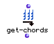

OpenMusic Reference  
---  
[Prev](geometric-ser)| | [Next](get-maquette)  
  
* * *

# get-chords

  
  
get-chords  
  
(score module) \-- extracts a list of **Chord** objects from an OM score class
object  

## Syntax

   **get-chords**  self  

## Inputs

name| data type(s)| comments  
---|---|---  
  _self_ |  a **Voice** , **Chord-seq** , **Poly** , or **Multi-seq** object.|  
  
## Output

output| data type(s)| comments  
---|---|---  
first| a list of **Chord** objects|  
  
## Description

This function extracts a list of **Chord** objects from any of the above class
objects. While such a list is available directly from the **Voice** and
**Chord-seq** objects, it is not available at the same output, hence the
utility of the function, which takes the  _self_  output from any of the above
objects.  get-chords  also saves the trouble of decomposing **Poly** and
**Multi-seq** objects in order to get at the lists of **Chord** objects within
them.

* * *

[Prev](geometric-ser)| [Home](index)| [Next](get-maquette)  
---|---|---  
geometric-ser| [Up](funcref.main)| get-maquette

