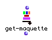

OpenMusic Reference  
---  
[Prev](get-chords)| | [Next](get-slot)  
  
* * *

# get-maquette

  
  
get-maquette  
  
(maquette module) \-- returns the **Maquette** to which a given
**Temporalbox** object belongs.  

## Syntax

   **get-maquette**  self  

## Inputs

name| data type(s)| comments  
---|---|---  
  _self_ |  a **Temporalbox**|  in 'itself' mode  
  
## Output

output| data type(s)| comments  
---|---|---  
first| a **Maquette** object|  
  
## Description

This function is the reverse of [ temporalboxes ](temporalboxes). Where
 temporalboxes  allows you to extract **Temporalbox** es from a **Maquette**
in 'itself' mode,  get-maquette  allows the reverse, effectively "climbing
back up the chain" to access the **Maquette** that the **Temporalbox**
originated from.

When might you want to do this? Imagine a function that plays the most 'notey'
one of a group of maquettes. Once you'd gotten through counting the number of
**Note** objects (probably with several  omloop s cycling through the
**Temporalbox** es making up the **Maquette** s), you'd wind up with a
**Temporalbox** from the **Maquette** you want to play, but you can't pass a
**Temporalbox** to the  play  function; you need a **Maquette**. Using  get-
maquette  on that **Temporalbox** returns the parent **Maquette** which can
then be passed to  play .

For a complete discussion of the maquette concept, see the chapter
[Maquettes](concepts.maquettes)

* * *

[Prev](get-chords)| [Home](index)| [Next](get-slot)  
---|---|---  
get-chords| [Up](funcref.main)| get-slot

