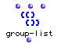
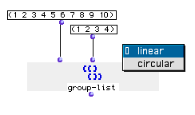
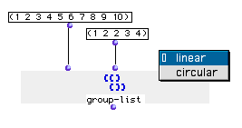
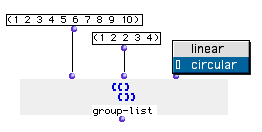

OpenMusic Reference  
---  
[Prev](get-slot)| | [Next](growing)  
  
* * *

# group-list

  
  
group-list  
  
(lists module) \-- returns a list divided into segments  

## Syntax

`` **group-list**` list segmentation mode `

## Inputs

name| data type(s)| comments  
---|---|---  
` _list_`|  a tree|  
` _segmentation_`|  a list of integers|  
` _mode_`|  menu| two options: linear and circular; defaults to linear  
  
## Output

output| data type(s)| comments  
---|---|---  
first| a tree|  
  
## Description

This module segments `_list_` into sublists of lengths given by the integers
in the list `_segmentation_`. In `_linear_` mode, the segmenting stops once
the function has exhausted the elements of `_list_`. In `_circular_` mode,
`group-list` starts over at the beginning of the list and continues until all
the segments given in `_segmentation_` are created.

## Examples

### Segmenting a list

Here, the numbers 1 through 10 are divided into subgroups of lengths given by
the second input. It returns:

`? OM->((1) (2 3) (4 5 6) (7 8 9 10))`

If we add an extra group of 2 at `_segmentation_` , the function exhausts the
elements of the list and stops, such that the last sublist has only 2 elements
even though 4 were specified:

`? OM->((1) (2 3) (4 5) (6 7 8) (9 10))`

However, if we change the mode to `_circular_` , the function continues at the
beginning after running out of elements:

`? OM->((1) (2 3) (4 5) (6 7 8) (9 10 1 2))`

* * *

[Prev](get-slot)| [Home](index)| [Next](growing)  
---|---|---  
get-slot| [Up](funcref.main)| growing?

