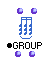

OpenMusic Reference  
---  
[Prev](chord-seq)| | [Next](maquetteclass)  
  
* * *

# Group

  
  
Group  
  
(score module) \--  

## Syntax

`` **Group**` self tree `

## Slots

name| data type(s)| comments  
---|---|---  
` _self_`| [ **Group**](groupclass) object|  
` _tree_`|  a rhythm tree|  
  
## Notes

See [the chapter on Rhythm Trees](concepts.rhythm-trees) for more
information on this special data-type.

* * *

[Prev](chord-seq)| [Home](index)| [Next](maquetteclass)  
---|---|---  
Chord-seq| [Up](classref.main)| Maquette

