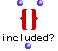

OpenMusic Reference  
---  
[Prev](group-list)| | [Next](infocanons)  
  
* * *

# included?

  
  
included?  
  
(sets module) \-- returns true if all the elements of  _lst1_  are also
elements of  _lst2_ . Otherwise, returns nil  

## Syntax

   **included?**  lst1 lst2 &optional test  

## Inputs

name| data type(s)| comments  
---|---|---  
  _lst1_ |  a list or tree|  
  _lst2_ |  a list or tree|  
  _test_ |  a symbol, function name or lambda function| optional; the test with which to compare elements of the two lists. Defaults to  equal   
  
## Output

output| data type(s)| comments  
---|---|---  
first| t or nil|  
  
## Description

This box compares two lists, returning true if all the elements in the first
are also elements of the second. If the optional  _test_  argument is added
(the default value is  equal ), the lists are compared globally according to
this [predicate](glossary#PREDICATE) instead. For example, if the
predicate is  > , the module returns true if all elements in  _lst1_  are
greater than at least one element in the second.

* * *

[Prev](group-list)| [Home](index)| [Next](infocanons)  
---|---|---  
group-list| [Up](funcref.main)| infocanons

