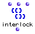
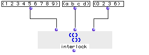

OpenMusic Reference  
---  
[Prev](infocanons)| | [Next](interpolation)  
  
* * *

# interlock

  
  
interlock  
  
(lists module) \-- inserts elements of a list between those of another  

## Syntax

`` **interlock**` lis1 lis2 plc1 `

## Inputs

name| data type(s)| comments  
---|---|---  
` _lis1_`|  a tree| the master list  
` _lis2_`|  a tree| the list of elements to insert  
` _plc1_`|  a list of integers| the locations at which to place elements from
`_lis2_`  
  
## Output

output| data type(s)| comments  
---|---|---  
first| a tree|  
  
## Description

Interlocks 2 lists. `interlock` attempts to place each element in `_lis2_`
**before** the elements in the positions indicated in the list `_plc1_`.
Positions which do not exist in `_lis1_` are skipped.

|

The order of the position indicators in `_plc1_` is not taken into account- it
is as if spaces in `_lis1_` are created before _all_ the positions in `_plc1_`
before any insertions are performed.  
  
---|---  
  
## Examples

### Inserting elements in a list

Returns:

`? OM->(a 1 2 b 3 c 4 5 6 d 7 8 9)`

Changing the order of the elements in `_plc1_` , (3 6 0 2) for example, would
not change the result

* * *

[Prev](infocanons)| [Home](index)| [Next](interpolation)  
---|---|---  
infocanons| [Up](funcref.main)| interpolation

