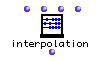
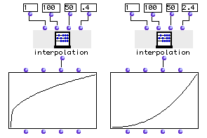

OpenMusic Reference  
---  
[Prev](interlock)| | [Next](last-elem)  
  
* * *

# interpolation

  
  
interpolation  
  
(arithmetic module) \-- interpolates between two numbers or lists  

## Syntax

   **interpolation**  begin end samples curve  

## Inputs

name| data type(s)| comments  
---|---|---  
  _begin_ |  a number or tree| the starting point for the interpolation  
  _end_ |  a number or tree| the end point for the interpolation  
  _samples_ |  a number| the number of elements to interpolate. Includes
 _begin_  and  _end_  ; a value of three is therefore equal to a single
interpolated value or list of values between the starting and ending point.  
  _curve_ |  a float| specifies the curve of the interpolated values. Defaults
to 1.0.  
  
## Output

output| data type(s)| comments  
---|---|---  
first| a tree| Returns a list of numbers or trees, being the interpolation
between  _begin_  and  _end_   
  
## Description

Creates a list or tree of values interpolated between the two first inputs.
The number of values interpolated is specified at the third input. Since the
first and the last elements of the result are the same as the starting and
ending values, the actual number of 'frames' in between the starting and
ending point is two less than the value specified at  _samples_ . The last
input specifies the curvature of the interpolation. With a value of 1.0, the
interpolation is 'flat,' meaning that the distance between any element and
it's neighbors is the same. Values smaller than 1.0 generate a convex
curvature, values greater than 1.0 generate a concave curvature. See the
example below.

See also the function [ samplefun ](samplefun).

## Examples

### What curvature means in interpolation

Above we see a graphic representation of the effects of changing the  _curve_ 
of the interpolation. Recall that a  _curve_  of 1.0 is a flat interpolation
where the elements are evenly-spaced. Here two interpolations have been
performed between the numbers 1 and 100, to the tune of 50 samples each. Both
interpolations have been plotted on the y-axis of a **bpf** object. On the
left, the  _curve_  has been set to .4. This causes the distances between the
elements to be larger earlier on in the interpolation, and the curve rises
faster (read left to right). On the right,  _curve_  has been set higher then
1.0, to 2.4. Thus, the elements are closer together earlier on in the
interpolation but further apart towards the upper end. The curve rises slowly
on the left and quickly on the right. Leaving  _curve_  at 1.0 would have
produced a straight diagonal line.

* * *

[Prev](interlock)| [Home](index)| [Next](last-elem)  
---|---|---  
interlock| [Up](funcref.main)| last-elem

