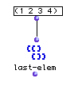
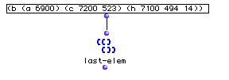

OpenMusic Reference  
---  
[Prev](interpolation)| | [Next](last-n)  
  
* * *

# last-elem

  
  
last-elem  
  
(lists module) \-- returns the last element of a list  

## Syntax

   **last-elem**  list  

## Inputs

name| data type(s)| comments  
---|---|---  
  _list_ |  a tree|  
  
## Output

output| data type(s)| comments  
---|---|---  
first| any| the data type will be that of the last element in the  _list_ .  
  
## Description

Returns the last element of the  _list_ . If the last element is itself a
list, this list is returned.

Compare with the LISP function  last , which returns the last _n_ elements of
a list, and thus always returns a list even if asked to return a single atom

## Examples

### Taking the last element of a list

A flat list (1 2 3 4) is passed to  last-elem , which returns

 ? OM->4 

and here

OM will return

 ? OM->(h 7100 494 144) 

* * *

[Prev](interpolation)| [Home](index)| [Next](last-n)  
---|---|---  
interpolation| [Up](funcref.main)| last-n

