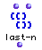

OpenMusic Reference  
---  
[Prev](last-elem)| | [Next](length)  
  
* * *

# last-n

  
  
last-n  
  
(lists module) \-- returns the last _n_ elements of a list  

## Syntax

`` **last-n**` list n `

## Inputs

name| data type(s)| comments  
---|---|---  
` _list_`|  a tree|  
` _n_`|  a non-negative integer|  
  
## Output

output| data type(s)| comments  
---|---|---  
first| a tree|  
  
## Description

Returns the last `_n_` elements of the `_list_`. If `_n_` is longer than the
length of `_list_` , the entire list is returned.

This function is identical to the LISP function `last`.

|

`last-n` always returns a list even if asked to return just one element. To
isolate the last element of a list as an atom, use [`last-elem`](last-
elem).  
  
---|---  
  
* * *

[Prev](last-elem)| [Home](index)| [Next](length)  
---|---|---  
last-elem| [Up](funcref.main)| length

