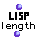

OpenMusic Reference  
---  
[Prev](last-n)| | [Next](linear-fun)  
  
* * *

# length

  
  
length  
  
(lisp module) \-- returns the number of elements in `_sequence_`  

## Syntax

`` **length**` sequence `

## Inputs

name| data type(s)| comments  
---|---|---  
` _sequence_`|  list|  
  
## Output

output| data type(s)| comments  
---|---|---  
first| a non-negativeinteger|  
  
## Description

[`length`](length) does exactly what it says- it returns the number of
1st-level elements in the list it is passed.

* * *

[Prev](last-n)| [Home](index)| [Next](linear-fun)  
---|---|---  
last-n| [Up](funcref.main)| linear-fun

