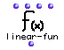

OpenMusic Reference  
---  
[Prev](length)| | [Next](list)  
  
* * *

# linear-fun

  
  
linear-fun  
  
(functions module) \-- returns a function object for the linear function
connecting the points represented by the input pairs  

## Syntax

`` **linear-fun**` x0 y0 x1 y1 `

## Inputs

name| data type(s)| comments  
---|---|---  
` _x0_`|  a number| defaults to 0  
` _y0_`|  a number| defaults to 0  
` _x1_`|  a number| defaults to 1  
` _y1_`|  a number| defaults to 1  
  
## Output

output| data type(s)| comments  
---|---|---  
first| a function object|  
  
## Description

`linear-fun` takes the points (x0,y0) and (x1,y1) and solves for the linear
equation y=ax+b. This is the equation of the line passing through both points.
This function can be passed the `samplefun`, for example.

* * *

[Prev](length)| [Home](index)| [Next](list)  
---|---|---  
length| [Up](funcref.main)| list

