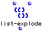

OpenMusic Reference  
---  
[Prev](list)| | [Next](list-filter)  
  
* * *

# list-explode

  
  
list-explode  
  
(lists module) \-- Divides  _list_  into  _nlists_  sublists of consecutive
elements.  

## Syntax

   **list-explode**  list nlists  

## Inputs

name| data type(s)| comments  
---|---|---  
  _list_ |  a tree|  
  _nlists_ |  a non-negativeinteger| the number of sublists to produce  
  
## Output

output| data type(s)| comments  
---|---|---  
first| a tree|  
  
## Description

 list-explode  attempts to subdivide  _list_  into  _nlists_  sublists of
equal length. The lists will be of different lengths if  _list_  cannot be
evenly divided by  _nlists_ .

If  _nlists_  exceeds the number of elements in  _list_  , the last element is
repeated until  _nlists_  lists have been created.

## Examples

### Using  list-explode 

If (1 2 3 4 5 6 7 8 9) is passed as  _list_  and  _nlists_  is set to two, we
get:

 ? OM->((1 2 3 4 5) (6 7 8 9)) 

* * *

[Prev](list)| [Home](index)| [Next](list-filter)  
---|---|---  
list| [Up](funcref.main)| list-filter

