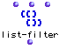

OpenMusic Reference  
---  
[Prev](list-explode)| | [Next](list-max)  
  
* * *

# list-filter

  
  
list-filter  
  
(lists module) \-- Filters elements from a list using the
[predicate](glossary#PREDICATE) `_test_`.  

## Syntax

`` **list-filter**` test list mode `

## Inputs

name| data type(s)| comments  
---|---|---  
` _test_`|  a symbol or function name or lambda function| The predicate to
apply. Defaults to `numberp`  
` _list_`|  a list| the list to filter  
` _mode_`|  menu| two options: pass and reject  
  
## Output

output| data type(s)| comments  
---|---|---  
first| a list|  
  
## Description

`list-filter` applies the function `_test_` to each element of `_list_`.
`_test_` may be any [predicate](glossary#PREDICATE), either a function
name or a patch in lambda mode. If mode is set to `_reject_` then elements
which return t when passed to `_test_` are rejected. If mode is set to
`_pass_` then only those elements are kept.

|

`list-filter` only operates on the first level of
[nesting](glossary#NESTING). Sublists are passed in their entirety to
`_test_`. To process sublists, use [`table-filter`](table-filter)  
  
---|---  
  
## Examples

### Filtering a list for numeric values

Here, the list is tested using `numberp`, a predicate which returns t only
when its object is a number. The function is in `_pass_` mode, so the output
will be:

`? OM->(1 2 3)`

Setting the mode to `_reject_` passes only those elements failing the test
`numberp`:

`? OM->(a b c)`

### Filtering a list using a lambda function

Here is an example of using a lambda function. The function `om>` is passed,
in lambda mode, with the second input set to 2. As usual with lambda
functions, the values will be passed to its first input.

All the elements of the list are passed, one by one, to `om>`. Since mode is
`_pass_` , only elements of the list greater than 2 will be passed:

`? OM->(3 4 5 6)`

* * *

[Prev](list-explode)| [Home](index)| [Next](list-max)  
---|---|---  
list-explode| [Up](funcref.main)| list-max

