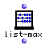

OpenMusic Reference  
---  
[Prev](list-filter)| | [Next](list-min)  
  
* * *

# list-max

  
  
list-max  
  
(arithmetic module) \-- returns the greatest value in a tree  

## Syntax

`` **list-max**` self `

## Inputs

name| data type(s)| comments  
---|---|---  
` _self_`|  a tree|  
  
## Output

output| data type(s)| comments  
---|---|---  
first| a number| returns the greatest value in the list or tree  
  
## Description

This function returns the largest value in the list.
[_Nesting_](glossary#NESTING) is ignored.

The function operates in the same way as the [`list-min`](list-min)
function. See its entry for an example.

* * *

[Prev](list-filter)| [Home](index)| [Next](list-min)  
---|---|---  
list-filter| [Up](funcref.main)| list-min

